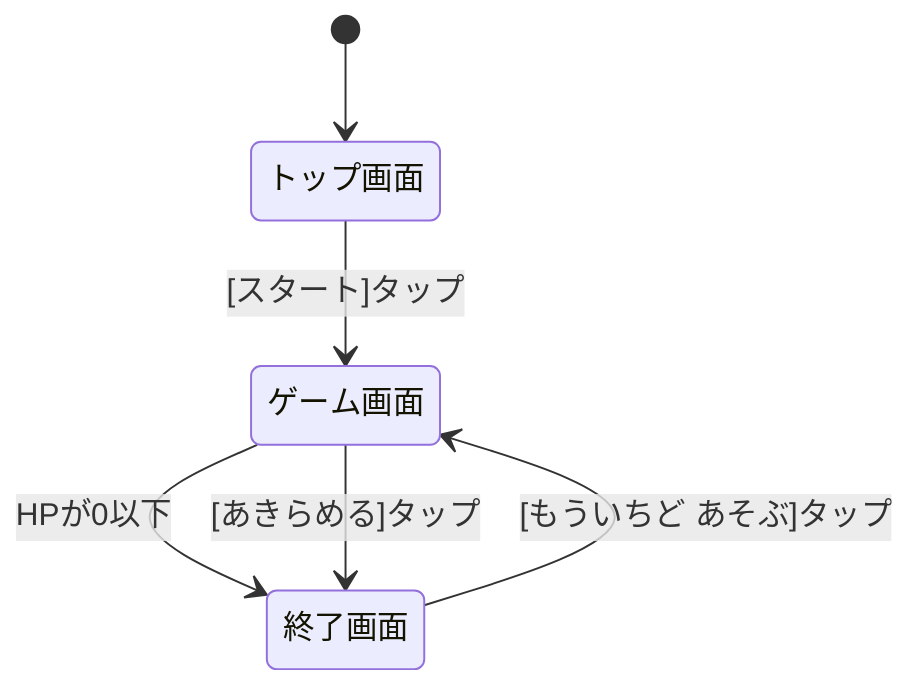

# スーパーボールすくい 詳細設計書

## 1. 概要

日本の夜店・屋台の定番「スーパーボールすくい」をスマホで遊べるWebアプリ。

- ポイ(薄い和紙を貼ったすくい道具)でプールに浮かぶスーパーボールをすくい、お椀に入れる
- 和紙の耐久度を体力(HP)として表現し、HPが0になるまですくい続ける
- すくえた個数がスコア。ハイスコアを記録して競う
- 画面下部の目押しバー(-50〜+50を自動往復)で「0」のタイミングですくうとHPが減らない

### 1.1 ターゲットユーザー

**3歳児がプレイできること**を最優先とする。

| 方針 | 具体策 |
|---|---|
| 分かりやすいUI | ボタンは大きく(最小タップ領域 64px)、文字はすべて**ひらがな・カタカナ** |
| なじみやすい配色 | 柔らかいパステル調 + 夜店・屋台を連想させるテーマ(後述) |
| 迷わない操作 | 操作は「タップのみ」。ダブルタップ・長押し・スワイプは無効 |
| 結果が視覚で分かる | 目押しバーはゾーンを色分けし、タップ結果を「ぴったり!」等の大きな文字と色で即時フィードバック |

### 1.2 テーマ配色(夜店・屋台)

全画面で共通のカラーパレットを使用する。

| 用途 | 色 | イメージ |
|---|---|---|
| 背景(上部) | 紺色 `#1b2a5e` 系グラデーション | 夏祭りの夜空 |
| アクセント | 赤 `#e8443a` / 白 | 提灯・屋台ののれん |
| 明かり | 暖色 `#ffd166` | 提灯の灯り・豆電球 |
| プール | 水色 `#aee3f5`〜`#6ec6e6` | ビニールプールの水面 |
| ボタン | 赤ベース + 白文字、角丸大きめ | 屋台の看板風 |
| ボール | パステル6色(ピンク/水色/黄/黄緑/紫/オレンジ) | スーパーボール |

装飾として、画面上部に提灯(ちょうちん)の並びをCSS/SVGで描画する。

---

## 2. 画面構成と遷移

画面は3つ。単一の `index.html` 内でDOMセクションを切り替えるSPA構成(ルーティング不要)。



---

## 3. 画面詳細

### 3.1 トップ画面

```
┌──────────────────────┐
│ 🏮 🏮 🏮 🏮 🏮      │ ← 提灯の装飾
│                      │
│   スーパーボール     │
│      すくい          │ ← タイトルロゴ(大きく、縁取り文字)
│                      │
│  さいこうきろく: 12こ │ ← ハイスコア(未プレイ時は非表示)
│                      │
│   ┌────────────┐     │
│   │  スタート  │     │ ← 画面中央下部の大ボタン
│   └────────────┘     │
└──────────────────────┘
```

| 要素 | 仕様 |
|---|---|
| タイトル | 「スーパーボールすくい」。ゆらゆら揺れる軽いアニメーション |
| ハイスコア表示 | `localStorage` から読み出し「さいこうきろく: Nこ」。記録がない場合は非表示 |
| スタートボタン | タップでゲーム画面へ遷移。押下時に縮むアニメーション+タップ音 |
| ミュートボタン | 画面右上に 🔊/🔇 トグル(全画面共通で右上に常駐) |

### 3.2 ゲーム画面

```
┌──────────────────────┐
│ ポイのたいりょく      │
│ [██████████░░]  💧x7 │ ← HPゲージ / すくった個数
│            [あきらめる]│
├──────────────────────┤
│  ～～～～～～～～～    │
│   🔴  🟡    🔵       │
│      🟢  🟣          │ ← プール(Canvas)
│  🟠      🔴          │   ボールがゆっくり流れる
│  ～～～～～～～～～    │
├──────────────────────┤
│ はずれ|まあまあ|ぴったり|まあまあ|はずれ │
│ [───────▼──────────] │ ← 目押しバー(-50〜+50)
└──────────────────────┘
```

#### 上部エリア

| 要素 | 仕様 |
|---|---|
| HPゲージ | 横バー。残量に応じて色が変化(緑→黄→赤)。ゲージ横にポイのアイコンを表示し、HP減少に応じて和紙の破れが進む見た目にする(3段階: 無傷/ひび/大きな破れ) |
| すくった個数 | 「💧 ×N」形式で大きく表示。すくうたびに+1でポップするアニメーション |
| あきらめるボタン | タップで即、終了画面へ(現在の個数をスコアとして確定)。誤タップ防止のためプールから離れた右上に配置し、他ボタンより小さめにする |

#### 中央エリア: プール(Canvas 2D)

| 項目 | 仕様 |
|---|---|
| 描画 | `<canvas>` に `requestAnimationFrame` で毎フレーム描画。水面は薄い波紋・ハイライトを描画 |
| ボールの流れ | プール内を緩い円状の水流に沿ってゆっくり周回(角速度に個体差+軽い上下の揺らぎ)。実物の「流れるプール」を模す |
| ボール数 | 常時 **10個** をプール内に維持。すくわれたら1.5秒後に画面外(水流の上流側)から新しいボールが流れてくる |
| ボールの種類 | サイズ2種 × 色6色 × 柄3種(無地/星/しま)をランダム組合せ |
| サイズ | 通常: 直径 44px 相当 / 大: 直径 66px 相当(出現比 7:3) |
| タップ判定 | `pointerdown` の座標とボール中心の距離で判定。当たり判定はボール半径 +8px(子ども向けに甘め)。複数該当時は最前面の1個 |

#### すくいアクション(タップ時のシーケンス)

```
ボールをタップ
  │ 1. 入力ロック(以降のタップを無視)
  │ 2. 目押しバー停止 & タップ時点の値 v を取得 → ゾーン判定
  │ 3. カットイン演出(約1.2秒)
  │     ・ポイのスプライトアニメ(25コマ)をボール位置に重ねて再生
  │     ・水しぶきパーティクル + 水音SE
  │     ・ボールがお椀(画面右下の小さなお椀アイコン)へ飛んでいく
  │     ・判定結果を大きく表示:「ぴったり!」(金色)/「まあまあ」(青)/「はずれ…」(灰)
  │ 4. スコア +1、ダメージ適用(HPゲージがアニメーションで減る+ダメージ音)
  │ 5. HP > 0 → バー再開・入力ロック解除
  │    HP ≤ 0 → 和紙が破れる演出(破れ音)→ 終了画面へ
```

- **すくいきるまで次のボールはすくえない**: 手順1のロックで保証する
- ロック中のタップは完全に無視(視覚的にはバーが止まっていることで「今は待つ」と分かる)

#### 下部エリア: 目押しバー

| 項目 | 仕様 |
|---|---|
| 値域 | -50 〜 +50 |
| 動き | 三角波(等速で往復)。**周期 2.4秒**(片道1.2秒)。3歳児向けにゆっくり |
| 表示 | 横向きバー + 現在値を示すマーカー(▼)。数値そのものは表示しない(子どもには色で伝える) |
| ゾーン色分け | ぴったり(中央): 金色 / まあまあ: 水色 / はずれ(両端): 灰色 |
| 開始位置 | ゲーム開始時・ロック解除時に位相をランダム化はせず、そのまま連続動作(動きを予測して目押しする楽しさを保つ) |

### 3.3 終了画面

```
┌──────────────────────┐
│ 🏮 🏮 🏮 🏮 🏮      │
│                      │
│    けっか            │
│    7 こ すくえた!    │
│                      │
│  「とてもじょうず!」  │ ← 誉め言葉(大きく)
│  🎉 さいこうきろく!   │ ← ハイスコア更新時のみ
│                      │
│  ┌────────────────┐  │
│  │ もういちど あそぶ │  │
│  └────────────────┘  │
└──────────────────────┘
```

| スコア | 誉め言葉 |
|---|---|
| 0 | ざんねん |
| 1〜3 | すごい! |
| 4〜9 | とてもじょうず! |
| 10以上 | すごすぎる! |

- スコアが数字でカウントアップするアニメーション+ファンファーレ音
- ハイスコア更新時は「🎉 さいこうきろく!」を追加表示し、`localStorage` を更新
- 「もういちど あそぶ」タップで状態をリセットしてゲーム画面へ

---

## 4. ゲームロジック仕様

### 4.1 パラメータ一覧

すべて `src/game/config.ts` に定数として集約し、バランス調整を1ファイルで行えるようにする。

| 定数 | 値 | 説明 |
|---|---|---|
| `HP_MAX` | 100 | 耐久度の初期値 |
| `BAR_MIN` / `BAR_MAX` | -50 / +50 | 目押しバーの値域 |
| `BAR_PERIOD_MS` | 2400 | バーの往復周期 |
| `ZONE_PERFECT` | \|v\| ≤ 10 | 「ぴったり」ゾーン |
| `ZONE_GOOD` | 10 < \|v\| ≤ 30 | 「まあまあ」ゾーン |
| `ZONE_BAD` | 30 < \|v\| ≤ 50 | 「はずれ」ゾーン |
| `DAMAGE_BASE` | 12 | 通常ボールの基本ダメージ |
| `BIG_BALL_FACTOR` | 1.5 | 大ボールのダメージ倍率 |
| `BAD_ZONE_FACTOR` | 2.0 | はずれゾーンのダメージ倍率 |
| `BALL_COUNT` | 10 | プール内のボール数 |
| `BIG_BALL_RATE` | 0.3 | 大ボールの出現率 |
| `SCOOP_ANIM_MS` | 1200 | カットイン演出の長さ |

### 4.2 ダメージ計算式

```
damage = DAMAGE_BASE
         × (ゾーン係数: ぴったり=0 / まあまあ=1 / はずれ=2)
         × (サイズ係数: 通常=1 / 大=1.5)
```

| | 通常ボール | 大ボール |
|---|---|---|
| ぴったり(\|v\|≤10) | **0** | **0** |
| まあまあ(\|v\|≤30) | 12 | 18 |
| はずれ(\|v\|>30) | 24 | 36 |

- 「ぴったり」なら何をすくってもノーダメージ(要件: 0のタイミングは耐久度が減らない)
- 「はずれ」は必要以上に減る(要件: ±50付近は大ダメージ)
- 目安: すべて「まあまあ」で通常ボールなら約8個、「はずれ」を連発すると3〜4個で終了

### 4.3 状態管理

```ts
interface GameState {
  hp: number;        // 現在の耐久度
  score: number;     // すくった個数
  locked: boolean;   // すくい演出中の入力ロック
  muted: boolean;    // ミュート状態(localStorageに保存)
}
```

画面遷移は `ScreenManager` が `top | game | result` の3状態を持ち、対応する `<section>` の表示を切り替える。

---

## 5. アセット仕様

### 5.1 ポイのスプライトシート(ユーザー提供)

| 項目 | 仕様 |
|---|---|
| 配置先 | `public/assets/poi.png` |
| 構成 | 5×5 = 25コマ。左上→右方向→次の行、の順で 1〜25 |
| 内容 | ポイが立った状態→水平に寝る→立った状態へ戻る回転アニメーション |
| 1コマのサイズ | 画像幅÷5 × 画像高さ÷5(正方形前提。コードでは実画像サイズから動的に算出) |
| 再生 | すくい演出中に 1→25 を約1秒で再生(約25fps相当)。Canvas の `drawImage` のソース矩形指定でコマ切り出し |

> **注**: 画像ファイルは実装フェーズ開始時にリポジトリへ追加していただく。

### 5.2 効果音(Web Audio APIで合成、音声ファイルなし)

| SE | タイミング | 音のイメージ |
|---|---|---|
| タップ音 | ボタン押下 | 短いポップ音 |
| 水しぶき音 | すくい演出 | ホワイトノイズ+フィルタで「ちゃぷん」 |
| ぴったり音 | ぴったり判定時 | 明るいキラキラ和音 |
| ダメージ音 | HP減少時 | 低めの「ペリッ」 |
| 破れ音 | HP0到達時 | ノイズ強めの「ビリッ」 |
| ファンファーレ | 終了画面表示時 | 短い上昇アルペジオ |

- 初回タップ時に `AudioContext` を初期化(モバイルの自動再生制限対応)
- ミュート状態は `localStorage` に保存

---

## 6. 技術構成

### 6.1 技術スタック

| 項目 | 採用技術 | 理由 |
|---|---|---|
| 言語 | TypeScript(strict) | 要件 |
| ビルド | Vite | 静的ファイル出力のみで GitHub Pages 制約を満たす。開発サーバも高速 |
| 実行環境 | Node.js(ビルド時のみ) | 実行時はブラウザのみで完結 |
| 描画 | Canvas 2D(プール)+ DOM/CSS(UI) | ボールの常時アニメはCanvasが軽量。ボタンやゲージはDOMがアクセシブルで作りやすい |
| 外部ライブラリ | なし | 依存を減らし、子ども向けの軽量なアプリにする |

### 6.2 ファイル構成

```
cc_kingyo/
├── index.html                  # 3画面のDOM + Canvas
├── package.json
├── tsconfig.json
├── vite.config.ts              # base: './' (Pagesサブパス対応)
├── public/
│   └── assets/
│       └── poi.png             # ★ユーザー提供のスプライトシート
├── src/
│   ├── main.ts                 # エントリ。ScreenManager初期化
│   ├── screens/
│   │   ├── top.ts              # トップ画面
│   │   ├── game.ts             # ゲーム画面(全体制御)
│   │   └── result.ts           # 終了画面
│   ├── game/
│   │   ├── config.ts           # §4.1 のパラメータ定数
│   │   ├── state.ts            # GameState
│   │   ├── pool.ts             # プール描画・水流・ループ
│   │   ├── ball.ts             # ボール生成・移動・タップ判定
│   │   ├── gauge.ts            # 目押しバー(三角波・ゾーン判定)
│   │   └── scoop.ts            # すくい演出(スプライト再生・水しぶき・お椀へ移動)
│   ├── audio.ts                # Web Audio 効果音
│   ├── storage.ts              # localStorage(ハイスコア・ミュート)
│   └── style.css               # テーマ配色・レイアウト
├── .github/
│   └── workflows/
│       └── deploy.yml          # GitHub Pages 自動デプロイ
└── docs/
    └── 詳細設計書.md            # 本書
```

### 6.3 スマホ縦画面最適化

| 項目 | 仕様 |
|---|---|
| viewport | `width=device-width, initial-scale=1, user-scalable=no` |
| レイアウト | `100dvh` 基準の縦Flexレイアウト(上部UI / プール(可変) / バー)。ノッチ対応に `safe-area-inset` を考慮 |
| 横画面 | 想定外。横向き時は「たてにしてね」のオーバーレイを表示 |
| タッチ操作 | `touch-action: manipulation` でダブルタップズーム抑止。`contextmenu` 抑止で長押しメニュー無効。ドラッグ・スワイプにはハンドラを持たない |
| 対象ブラウザ | iOS Safari / Android Chrome の最新±2バージョン |

### 6.4 GitHub Pages デプロイ

- `main` ブランチへの push をトリガーに GitHub Actions でビルド&デプロイ
  - `actions/checkout` → `actions/setup-node` → `npm ci && npm run build` → `actions/upload-pages-artifact`(`dist/`) → `actions/deploy-pages`
- `vite.config.ts` の `base: './'` により `https://<user>.github.io/cc_kingyo/` のサブパスでも動作
- サーバサイド処理なし・全アセット静的、で Pages の技術制約を満たす
- リポジトリ設定で Pages のソースを「GitHub Actions」にする(手動設定が1回必要)

---

## 7. 実装ステップ(次フェーズ)

1. プロジェクト雛形(Vite + TS + 3画面の骨組み、画面遷移)
2. ゲーム画面: プール描画とボールの流れ
3. 目押しバーとゾーン判定
4. すくい演出(スプライトアニメ・水しぶき・入力ロック)※ poi.png 受領後
5. HP・スコア・終了判定、終了画面とハイスコア保存
6. 効果音・ミュート
7. 配色・装飾の仕上げ、スマホ実機確認
8. GitHub Actions デプロイ設定

---

## 8. 未確定事項(実装前に確認)

- [ ] `poi.png`(25コマスプライトシート)のリポジトリへの追加
- [ ] ゲームバランス(§4.1 のパラメータ)は実装後に実際にプレイして調整する前提
